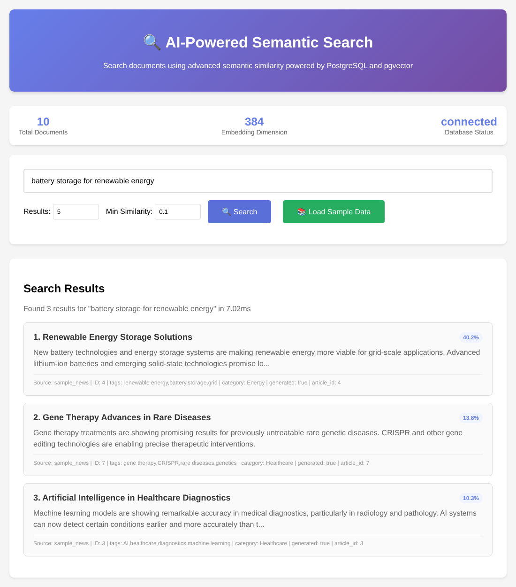
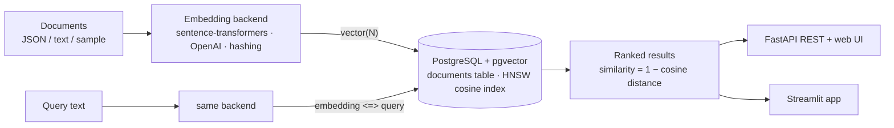

# Semantic Search with PostgreSQL + pgvector

[](https://github.com/mehmetarifkuzgun/AI-Powered-Semantic-Search-Engine-PostgreSQL/actions/workflows/ci.yml)


A small, readable semantic-search stack: documents are embedded (local **sentence-transformers**, **OpenAI**, or an offline test backend), stored in **PostgreSQL with a `vector` column and an HNSW index**, and queried by cosine similarity through a **FastAPI** REST API + web page and a **Streamlit** app.



> **How this screenshot was made — please read.** It is a real run of the FastAPI app against a real PostgreSQL 16 + pgvector 0.6 database with the 10 bundled sample articles. The sandbox it was produced in cannot download Hugging Face models, so it uses the repo's **offline `hashing` backend** (`EMBEDDING_MODEL=hashing`): a deterministic *lexical* embedding (hashed word/bigram features). It ranks by word overlap, **not meaning**, which is why the scores are low and why *Min Similarity* is set to 0.1 instead of the default 0.7. With `sentence-transformers/all-MiniLM-L6-v2` (the default) you get genuinely semantic matches; that path is implemented but was **not run** for these screenshots.

## Architecture



| File | Role |
|---|---|
| `embeddings.py` | `EmbeddingGenerator` interface; `SentenceTransformerEmbedding`, `OpenAIEmbedding`, `HashingEmbedding`; factory driven by `EMBEDDING_MODEL` |
| `database.py` | Connection handling, table + index creation, insert, similarity search (pgvector `<=>` cosine distance), dimension check |
| `semantic_search.py` | `SemanticSearchEngine`: load → embed in batches → insert; search; stats |
| `document_loader.py` | Sample / JSON / text-directory loaders |
| `fastapi_app.py` | REST API (`/api/search`, `/api/documents`, `/api/index`, `/api/stats`, `/health`) + single-page UI |
| `streamlit_app.py` | Streamlit front end with Plotly charts |
| `setup.py`, `demo.py` | Interactive setup check and a console walkthrough |

## Quick start

```bash
git clone https://github.com/mehmetarifkuzgun/AI-Powered-Semantic-Search-Engine-PostgreSQL.git
cd AI-Powered-Semantic-Search-Engine-PostgreSQL
docker compose up -d db                 # PostgreSQL 16 with pgvector preinstalled (or install pgvector yourself)
python -m venv .venv && source .venv/bin/activate
pip install -r requirements.txt
cp .env.example .env                    # adjust credentials if you changed docker-compose.yml
python setup.py                         # checks the connection, enables the extension, creates the table
python fastapi_app.py                   # http://127.0.0.1:8000   (or: streamlit run streamlit_app.py)
```

In the web UI click **Load Sample Data** (10 articles), then search. No GPU or API key needed for the default local model (the first run downloads the model, roughly 90 MB). To try the pipeline with **no download at all**, set `EMBEDDING_MODEL=hashing` and lower *Min Similarity*.

### Use it from Python

```python
from semantic_search import create_search_engine

engine = create_search_engine()                       # backend chosen by EMBEDDING_MODEL
engine.load_and_index_documents("sample", num_articles=10)
for hit in engine.search("battery storage for renewable energy", limit=3, similarity_threshold=0.1):
    print(hit["similarity_score"], hit["title"])
```

### Design notes

- **Similarity** is `1 − cosine_distance`; `similarity_threshold` filters on it. Good thresholds depend on the model (MiniLM scores differ from OpenAI or the hashing backend) — tune per model.
- **HNSW, not IVFFlat.** An IVFFlat index built on an empty or tiny table has no useful centroids and gives poor recall; HNSW (pgvector ≥ 0.5) behaves well from the first row.
- **Vector size is checked** when the table is created: switching to a model with a different dimension raises a clear error instead of failing on insert.
- Metadata is stored as `JSONB`; the app and database use the same `EMBEDDING_DIMENSION`.

## Tests

```bash
pip install -r requirements-dev.txt
pytest -q          # needs PostgreSQL + pgvector (POSTGRES_* env vars); DB tests are skipped otherwise
```

22 tests, no model download or API key (they use the `hashing` backend): embedding properties; **top-1 retrieval for five queries against the real database**, threshold filtering, JSONB round-trip, HNSW index presence, dimension-mismatch error; FastAPI endpoints incl. validation; and a Streamlit render smoke test. Each session creates and drops its own throw-away database. CI runs them against a `pgvector/pgvector:pg16` service container on Python 3.11/3.12.

## Known limitations

- **Semantic quality was not evaluated.** There is no retrieval benchmark; tests check pipeline correctness (and lexical top-1 on 5 hand-written queries), not the relevance of MiniLM/OpenAI embeddings.
- **The sample corpus is tiny:** 10 distinct hand-written articles. Requesting more (`num_articles > 10`) produces *copies* titled "… - Update N", so results contain duplicates; use `document_loader` with your own JSON/text data for anything real.
- Search is a plain vector scan with a threshold filter (post-filtering with HNSW can return fewer than `limit` rows); no hybrid keyword + vector ranking, re-ranking, chunking of long documents, or authentication (CORS is `*`).
- `docker-compose.yml` and the pgvector image were not run in the environment this was prepared in (CI uses the same image); `setup.py`/`start.bat` were not re-tested.
- Embeddings for OpenAI require `OPENAI_API_KEY` and were not exercised.

## Fixes made while preparing this repo for publication

Found by running everything against a real PostgreSQL + pgvector:

1. **Search crashed** (`operator does not exist: vector <=> numeric[]`): embeddings were sent as plain Python lists, which psycopg2 turns into `numeric[]`. They are now sent as pgvector text literals with an explicit `::vector` cast.
2. **Document inserts with metadata would have failed** (a `dict` is not a psycopg2 parameter); metadata is now wrapped as JSON.
3. **`similarity_threshold: 0` was silently replaced by 0.7** (`value or default`) in the API and the web UI.
4. **IVFFlat index on an empty table** → replaced by HNSW; added the vector-dimension check.
5. SQLAlchemy 2.1 defaults `postgresql://` to psycopg v3 → the URL is normalised to `postgresql+psycopg2://`.
6. The engine ignored `EMBEDDING_MODEL` unless it was passed explicitly; `fastapi_app.py` used deprecated pydantic-v1 validators; the UI's *Load Sample Data* created duplicate rows (20 articles from 10) and its search box overflowed its card.
7. **Security/housekeeping:** a committed **`.env`** and committed `.pyc` files were removed from the tree (git history still contains them — **rotate any credential that was ever in that `.env`**), `.env.example` (which the old README referenced but did not exist) and `.gitignore` added; dependency pins replaced by tested ranges; unused `datasets`/`pgvector` Python packages dropped.

## License

No license file is included yet — add one before reusing the code.
